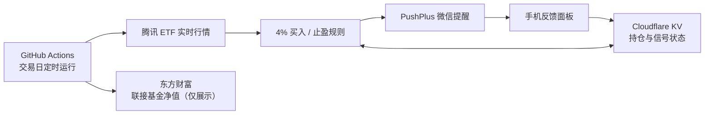

# Fund Monitor：4% 定投提醒机器人

[](https://github.com/Koko-ry/fund-monitor/actions/workflows/fund_monitor.yml)


一个面向中国场外指数基金的开源提醒机器人。它在交易日收盘前读取对应场内 ETF 行情，按照可配置的分档规则生成买入和止盈提醒，通过 PushPlus 发送到微信，并提供安全的手机反馈面板。

机器人只负责提醒和记录，永远不会自动下单。只有用户明确点击“确认已买入”或“确认已卖出”后，持仓状态才会改变。

> 项目灵感来自研究员雷牛牛分享的“4% 定投法”，属于独立的软件实现，与相关作者、基金公司、PushPlus、GitHub 或 Cloudflare 均无官方隶属关系。

## 功能

- 多基金、多 ETF 配置。
- ETF 对 ETF 的同口径价格比较，避免混用场外净值与场内价格。
- 相对上次确认买入锚点下跌指定比例时提醒分批买入。
- 可配置最大持有份数。
- 达到收益观察线后跟踪高点，回撤指定比例时提醒止盈。
- 自动识别陈旧行情，节假日不误触发。
- PushPlus 个人微信和企业微信通知。
- GitHub Actions 云端定时运行，电脑无需开机。
- Cloudflare Worker 手机操作面板。
- HMAC 签名反馈链接、Bearer 状态 API 和自动化测试。

## 工作方式



场外基金净值只用于记录实际确认净值，不参与 ETF 触发价计算。

## 策略规则

默认参数：

1. 首次运行使用 ETF 昨收建立初始锚点。
2. ETF 相对锚点下跌 4% 时产生待确认买入信号。
3. 用户实际申购并确认后，信号时 ETF 价格成为下一档锚点。
4. 默认最多持有 10 份。
5. ETF 相对当前持仓等价均价上涨 15% 后进入止盈观察。
6. 从观察高点回撤 4% 时产生待确认卖出信号。

所有比例和份数均可在 `funds.json` 中修改。这是一套执行规则，不代表适合所有人的投资策略。

## 手机反馈面板

买入信号支持：

- **确认已买入**：唯一会增加持仓的操作。
- **明天提醒**：下一交易日重新判断。
- **跳过本档**：再跌一个档位，或价格恢复后重新跌破时提醒。
- **暂停基金**：停止该基金的买入提醒。

卖出信号支持：

- **确认已卖出**：选择卖出份数；唯一会减少持仓的操作。
- **明天提醒**：下一交易日重新判断止盈条件。
- **跳过本次止盈**：以当前 ETF 价格重新跟踪回撤。
- **暂停止盈提醒**：独立于买入提醒。

## 快速开始

### 1. Fork 并配置基金

编辑 `funds.json`：

```json
[
  {
    "fund_code": "110020",
    "fund_name": "易方达沪深300ETF联接A",
    "etf_market": "sh",
    "etf_code": "510300",
    "total_shares": 10,
    "trigger_pct": 4.0,
    "enable_sell_signal": true,
    "sell_profit_trigger_pct": 15.0,
    "sell_drawdown_pct": 4.0
  }
]
```

字段说明：

| 字段 | 含义 |
|---|---|
| `fund_code` | 场外联接基金代码 |
| `fund_name` | 通知中显示的名称 |
| `etf_market` | `sh`、`sz` 或 `bj` |
| `etf_code` | 对应场内 ETF 代码 |
| `total_shares` | 最大分批份数 |
| `trigger_pct` | 每档买入跌幅 |
| `sell_profit_trigger_pct` | 进入止盈观察的收益率 |
| `sell_drawdown_pct` | 从观察高点回撤多少时提醒 |

请自行核实联接基金与 ETF 的对应关系。

### 2. 配置 PushPlus

取得 PushPlus Token 后，在 Fork 仓库中打开：

`Settings → Secrets and variables → Actions → New repository secret`

添加：

| Secret | 必需 | 作用 |
|---|---|---|
| `PUSHPLUS_TOKEN` | 是 | 推送到个人微信 |

如果只需要微信提醒、不需要手机反馈面板，完成这一步即可在本机运行；云端持久化建议继续配置 Cloudflare。

### 3. 部署反馈服务

需要 Node.js 20+：

```bash
cd worker
npm install
npx wrangler login
npx wrangler kv namespace create fund-monitor-state
```

复制配置模板：

```bash
cp wrangler.example.toml wrangler.toml
```

将命令输出的 KV Namespace ID 填入 `wrangler.toml`，然后设置两枚随机密钥：

```bash
npx wrangler secret put STATE_API_TOKEN
npx wrangler secret put FEEDBACK_SIGNING_SECRET
npx wrangler deploy
```

把相同的值写入 GitHub Actions Secrets，并补充部署地址：

| Secret | 示例 |
|---|---|
| `STATE_API_URL` | `https://你的-worker.workers.dev/state` |
| `STATE_API_TOKEN` | 与 Worker 中一致 |
| `FEEDBACK_BASE_URL` | `https://你的-worker.workers.dev` |
| `FEEDBACK_SIGNING_SECRET` | 与 Worker 中一致 |

初始化远程状态时，可以复制 `fund_state.example.json` 为 `fund_state.json`，修改后通过状态 API 或 Wrangler KV 写入。

### 4. 启用 GitHub Actions

仓库包含两个工作流：

- `4%定投法每日监控`：默认工作日北京时间 14:25、14:40、14:50 尝试运行。GitHub 定时任务可能延迟或被丢弃，多时点触发用于提高可靠性；普通“无需操作”通知一天只发送一次。若定时任务实际运行晚于 15:05，默认跳过普通买入/卖出/等待提醒，避免盘后误提醒。
- `手动更新基金状态`：用于补录、修正、暂停或恢复提醒。

在 `Settings → Secrets and variables → Actions → Variables` 新建：

`ENABLE_MONITOR=true`

未设置该变量时，定时任务保持关闭；手动触发仍可用于测试。

GitHub 定时任务可能延迟，它不是精确定时交易系统。可以通过 Actions 变量 `LATEST_SCHEDULE_PUSH_TIME=15:05` 调整盘后提醒安全闸；留空则不启用该闸门。

## 本机运行

Python 3.11+，核心脚本仅使用标准库：

```bash
export PUSHPLUS_TOKEN="your-token"
python -m unittest -v
python fund_monitor_pushplus.py
```

PowerShell：

```powershell
$env:PUSHPLUS_TOKEN="your-token"
python -m unittest -v
python fund_monitor_pushplus.py
```

常用状态命令：

```bash
python manage_state.py status
python manage_state.py confirm 110020 1.0000
python manage_state.py sell 110020 2 1.1000
python manage_state.py pause 110020
python manage_state.py resume 110020
python manage_state.py resume-sell 110020
```

## 状态与隐私

`fund_state.json` 和 `daily_log.jsonl` 默认被 `.gitignore` 排除。公开 Fork 应使用 Cloudflare KV 或兼容的私有状态 API，不要把真实持仓提交到公开仓库。

如果确实在私有 Fork 中希望 Actions 自动提交状态和日志，可创建仓库变量：

`PERSIST_STATE_TO_REPO=true`

公开仓库不建议启用该选项。

兼容状态 API 协议：

- `GET STATE_API_URL`：返回完整状态对象，或 `{"state": {...}}`。
- `PUT STATE_API_URL`：请求体为完整状态对象。
- 请求携带 `Authorization: Bearer <STATE_API_TOKEN>`。

## 项目结构

| 路径 | 作用 |
|---|---|
| `funds.json` | 基金和策略配置 |
| `fund_monitor_core.py` | 行情、状态和信号逻辑 |
| `fund_monitor_pushplus.py` | PushPlus 通知入口 |
| `fund_monitor.py` | 企业微信通知入口 |
| `manage_state.py` | 状态管理命令 |
| `worker/` | Cloudflare 反馈面板和状态 API |
| `.github/workflows/` | 云端监控与手动状态工作流 |
| `test_fund_monitor.py` | Python 核心测试 |
| `worker/test.mjs` | Worker 状态动作测试 |

## 测试

```bash
python -m unittest -v

cd worker
npm install
npm test
```

测试重点保证：

- 提醒不会自动增加或减少持仓。
- 只有确认操作会修改持仓。
- 跳过、延后和暂停不会伪造成交。
- 陈旧行情不会触发信号。
- 买入与卖出状态相互独立。

## 安全

请阅读 [SECURITY.md](SECURITY.md)。不要把 Token、真实状态文件或日志提交到仓库。

## 贡献

欢迎提交 Issue 和 Pull Request。建议在 PR 中包含：

- 变更原因；
- 对状态机和交易边界的影响；
- 新增或更新的测试；
- 是否影响现有部署配置。

## 免责声明

本项目仅用于技术研究、提醒和个人记录，不构成投资建议，也不保证行情接口、定时任务或第三方通知服务持续可用。用户应独立判断交易时点、费用、跟踪误差、流动性及自身风险承受能力。

## License

本项目使用 [MIT License](LICENSE)。
